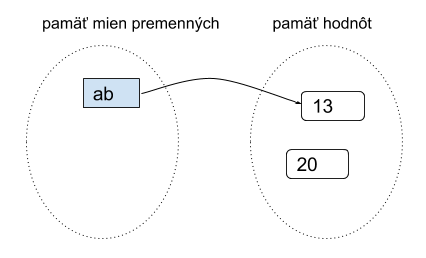

>### Základné pojmy, premenná a priradenie

O premenným môžeme hovoriť ako o rezervovaní miesta v pamäti na ukladanie hodnôt. 
* premenná sa vytvorí priraďovacím príkazom (ak ešte doteraz neexistovala). Hodnoty sa teda pripisujú pomocou „=“, kde na ľavej strane sa nachádza názov premennej a napravo hodnota ktorú jej priraďuejme:
>zapisujeme to :&emsp; &nbsp; **premenná = hodnota**

tento zápis znamená, že do ***premennej*** sa má priradiť zadaná ***hodnota***

Deklarovaním premennej určíme jej názov a dátový typ (platí to aj pre iné programovacie jazyky). Takejto premennej sa vyhradí miesto v pamäti spolu s hodnotou, ak ju určíme.
* v skutočnosti sa však na rozdiel od iných programovacích jazykov v Pythone do premennej priradí iba **referencia (odkaz)** na danú hodnotu (a nie samotná hodnota)
* ďalšie priradenie do tej istej premennej zmení túto referenciu
* na tú istú hodnotu sa môže odkazovať aj viac premenných
* meno môže referencovať (mať priradenú) maximálne jednu hodnotu
* 

Každá hodnota v Pythonu je určitého datového typu. Do premennej sa dajú ukladať hodnoty rôznych dátových typov. V jazyku Python ich pri premenných ale nie je potrebné pred používaním deklarovať, deje sa to automaticky pri priradení hodnoty k premennej. Python si sám zistí, akého typu je hodnota a vnútorne si to eviduje.**Každá premenná** je v jazyku Python totiž tiež ako aj všetky ostatné stavebné komponenty **objektom**. Môžeme ich definovať ako miesto v pamäti k uloženiu určitej hodnoty. Python si v svojej pamäti udržuje všetky premenné (v tzv. pamäti mien premenných) a všetky momentálne vytvorené hodnoty (v tzv. pamäti hodnôt). Po vykonaní týchto troch priraďovacích príkazov:
~~~
>>> a = 17
>>> b = 'abcd'
>>> x = a
~~~
To v pamäti Pythonu bude vyzerať nejako takto:

* Vidíme, že priradenie do jednej premennej nejakej inej premennej (napr. x = a) neznamená referenciu na meno ale na jej hodnotu 
* najprv sa zistí hodnota na pravej strane príkazu a až potom sa spraví referencovanie (priradenie) do premennej na ľavej strane
V ďalšom príklade vidíme, ako to funguje, keď vo výraze na pravej strane (kde je priraďovaná hodnota) sa nachádza tá istá premenná, ako na ľavej strane (teda kam priraďujeme):
~~~
>>> ab = 13
>>> ab = ab + 7
~~~
1. najprv má ab hodnotu 13

2. potom sa vypočíta nová hodnota 20 (ako súčet ab + 7)

3. do premennej ab sa priradí nová hodnota

## Meno premennej 
* môže obsahovať písmená, číslice a znak podčiarkovník
* pozor na to, že v Pythone sa rozlišujú malé a veľké písmená
* musí sa líšiť od Pythonovských príkazov, tzv. rezervovaných slov (napr. for, if, def, return, …)

 Názov premennej má určité pravidlá:

## Nesmie začínať číslom, jedine písmenom alebo „_“

osX, _osY - je správne

24osX, 0vysledok0 - nie je správne

## V názve sa môžu nachádzať len čísla, písmená a „_“

dotyk_pin0 - správne

dotyk.pin0 - nesprávne

## Premenné sú citlivé na veľké/malé písmená

V skratke to znamená, že ak je premenná napísaná správne, každým rozdielom v premenných vzniká ďalšia - Strana_A, strana_A, strana_a - tri rôzne premenné.
## Možné problémy s menami premenných

Mená premenných môžu byť skoro ľubovoľné reťazce, zložené z písmen (malých a veľkých), číslic a znaku podčiarkovník. Keďže mená premenných si najčastejšie programátori vymýšľajú sami, neskúsený programátor môže pri tom narobiť problémy nielen druhým, ale aj sebe, keď sa potom nevyzná ani vo svojom vlastnom programe. Uvedieme niekoľko typických problémov.
* Veľké písmená v menách premenných treba používať veľmi opatrne. Všimnite si, že všetky tieto premenné sú rôzne:
~~~
>>> Pocet = 10
>>> POCET = 20
>>> PoCet = 30
>>> PoceT = 40
~~~
* V Pythone majú programátori dohodu, že na mená premenných sa používaú len malé písmená (prípadne aj číslice a podčiarkovník).
* Tiež si treba dávať pozor na ľahko zameniteľné znaky, napr. písmeno O a číslica 0 a tiež písmeno l a číslica 1:
~~~
>>> OO1 = 15
>>> O01 = 16
>>> print(OO1, O01)
15 16
>>> d1zka = 15
>>> dlzka = d1zka + 1
~~~
* Snažíme sa nepoužívať ani slová, v ktorých často robíme preklepy, napr.
~~~
>>> kalerab = 'mnam'
>>> karelab = 'fuj'
~~~
## Správne zvolené mená premenných

Pri písaní programov používame čo najvhodnejšie mená premenných.

Napr. tento program má veľmi nezrozumiteľné mená a preto sa horšie chápe, čo vlastne počíta:
~~~
vrk = 16
mrk = 3.14
drk = 2 * vrk * mrk
frk = vrk * mrk * vrk
print('drk =', drk)
print('frk =', frk)
~~~
Stačí dať menám premenných zodpovedajúce texty, napr.
~~~
polomer = 16
pi = 3.14
obvod = 2 * pi * polomer
obsah = pi * polomer ** 2
print('obvod =', obvod)
print('obsah =', obsah)
~~~
Tento zápis programu je zrazu oveľa zrozumiteľnejší (hoci robí presne to isté, ako predchádzajúci). 
**Treba si uvedomiť že zápisu programu má rozumieť hlavne človek.** Program bude spracovávať počítač - stroj a tomu je jedno, aké sú tam mená premenných.

# Zhrnutie

Príkazom print(x) jednoducho vypíšeme hodnotu uloženú v premennej x. Pri zlučovaní dvoch premenných platí pravidlo, že nie je možné zlúčiť dve premenné rôznych typov bez deklarovania ich typu. Príklad:

https://pythontutor.com/python-debugger.html#mode=edit 

print("string" + 14) &emsp; &nbsp;&emsp; &nbsp;   # Nastane chyba lebo sa spaja str s int
## Správne použitie
var = "string "\
num = 14\
print(var + str(num))
