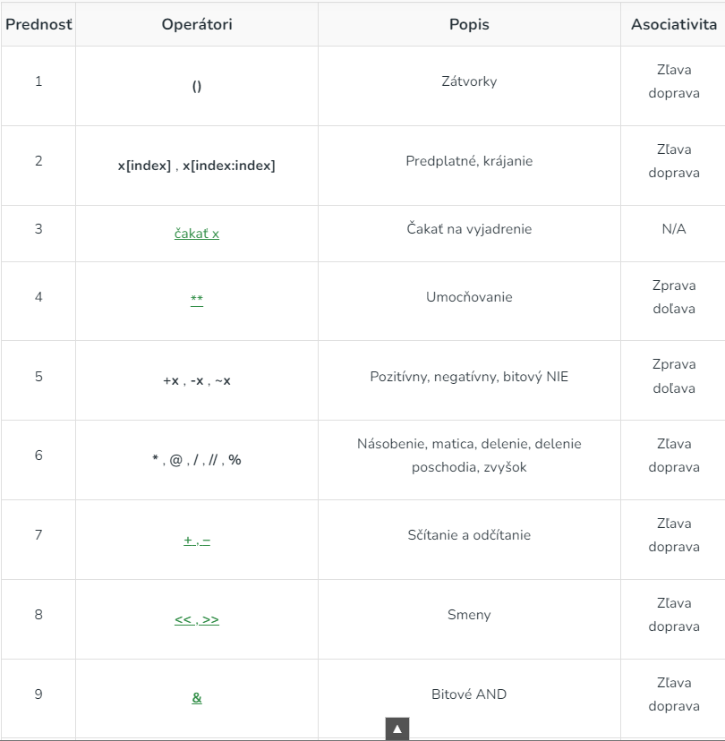
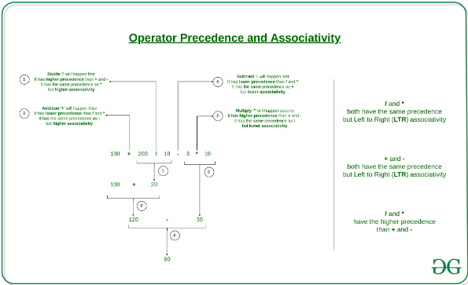

>### Základné operátori v Pythone a ich priority

https://www.geeksforgeeks.org/precedence-and-associativity-of-operators-in-python/

V tabuľke máme uvedené jednotlivé operátori používané v Pythone spolu s ich prioritou vykonávania a postupu ako sa vykonávajú (asociativita). V tejto tabuľke sú uvedené všetky operátory od najvyššej po najnižšiu prioritu.

### Prednosť operátorov Pythonu
Používa sa vo výraze s viac ako jedným operátorom s rôznou prioritou na určenie, ktorá operácia sa má vykonať ako prvá.

Príklad:
Úlohou je vytvoriť kód pre správne vyriešenie vzťahu (10 + 20 * 30)

~~~
vzťah 10 + 20 * 30 sa má vypočítať ako 10 + (20 * 30)
 a nie ako (10 + 20) * 30
~~~
~~~
# Prednosti operatorov '+' a '*'
expr = 10 + 20 * 30

print(expr)
~~~

### Prednosť logických operátorov v 

V danom kóde sa blok ' if ' vykoná aj vtedy, ak je vek 0. Pretože priorita logického operátora' and ' je väčšia ako priorita logického operátora ' or '. 

~~~
# Prednost 'or' a 'and'
name = "Alex"
age = 0

if name == "Alex" or name == "John" and age >= 2:
	print("Hello! Welcome.")    # toto bude vysledok
else:
	print("Good Bye!!")
~~~

~~~
# Precedence of 'or' & 'and'
name = "Alex"
age = 0

if (name == "Alex" or name == "John") and age >= 2:
	print("Hello! Welcome.")
else:
	print("Good Bye!!")     # toto bude vysledok
~~~

### Asociativita operátorov Pythonu

Ak výraz obsahuje dva alebo viac operátorov s rovnakou prioritou, potom sa na určenie používa asociativita operátorov. Môže to byť zľava doprava alebo sprava zľava .

Príklad:
V tomto kóde majú „*“ a „/“ rovnakú prednosť a ich asociativita je zľava doprava , takže výraz „100 / 10 * 10“ sa považuje za „(100 / 10) * 10“.

~~~
# vypocet z lava do prava
# 100 / 10 * 10 je pocitany ako
# (100 / 10) * 10 a nie ako
#  100 / (10 * 10)
print(100 / 10 * 10)

# vypocet z lava do prava
# 5 - 2 + 3 je pocitany ako
# (5 - 2) + 3 a nie ako
# 5 - (2 + 3)
print(5 - 2 + 3)

# vypocet z lava do prava
print(5 - (2 + 3))

# vypocet z prava do lava
# 2 ** 3 ** 2 je pocitany ako
# 2 ** (3 ** 2) a nie ako
# (2 ** 3) ** 2
print(2 ** 3 ** 2)
~~~

### Precedencia a asociativita operátorov v Pythone

Precedencia a asociativita operátorov sú dve hlavné charakteristiky operátorov, ktoré určujú poradie hodnotenia podvýrazov bez zátvoriek.

Príklad:

Úlohou je vytvoriť kód pre správne vyriešenie vzťahu 100 + 200 / 10 - 3 * 10

~~~
100 + 200 / 10 - 3 * 10 sa vypočíta ako 100 + (200 / 10) - (3 * 10) 
a nie ako (100 + 200) / (10 - 3) * 10
~~~

~~~
expression = 100 + 200 / 10 - 3 * 10
print(expression)
~~~

### Neasociatívni operátori

V Pythone má väčšina operátorov asociatívnosť, čo znamená, že sa vyhodnocujú zľava doprava alebo sprava doľava, keď majú rovnakú prednosť. Existuje však niekoľko operátorov, ktoré nie sú asociatívne, čo znamená, že ich nemožno spojiť.

Príklad:
~~~
a = 5
b = 10
c = 15

a = b = (a < b) += (b < c)
~~~
Výsledkom je chyba nepovolená syntax (zápis):
~~~
a = b= (a < b) += (b < c) 
               ^^ 
SyntaxError: invalid syntax
~~~