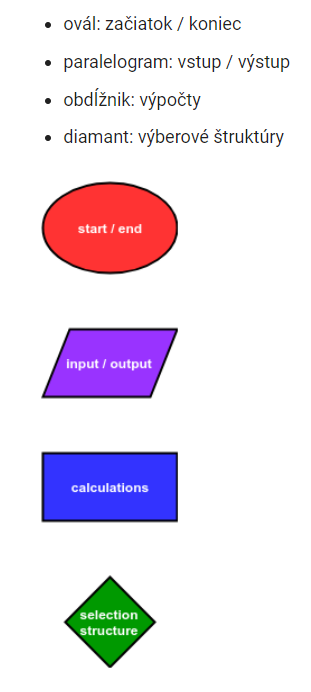
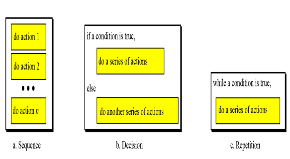
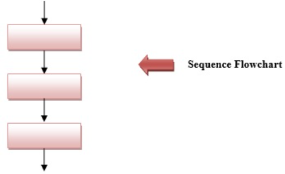
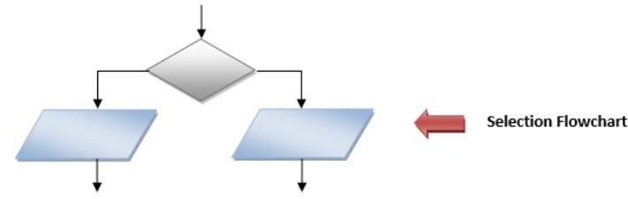
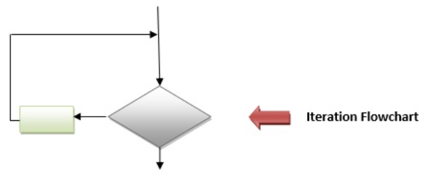
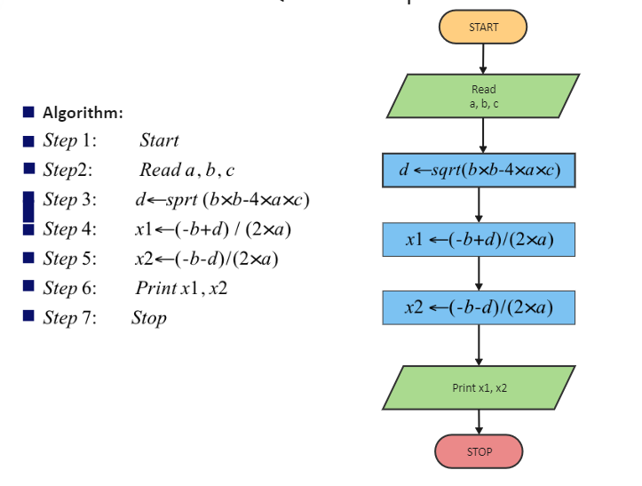

>### Pojem algoritmu a algoritmické konštrukcie

### Čo je to algoritmus ?

V tej najjednoduchšej definícii je algoritmus postup pre riešenie konkrétneho problému. V podstate všetko, čo sa nedá riešiť zavolaním nejakej predpripravenej alebo knižničnej funkcie programovacieho jazyka musíme krok za krokom vymyslieť a zapísať ako postupnosť príkazov.

Grafickým znázornením algoritmu je vývojový diagram. Vývojový diagram je nakreslený pomocou stanovených symbolov a každý symbol sa používa na konkrétny účel, má svoj určený tvar a názov.

* Symboly vývojového diagramu sú štandardizované podľa ANSI 
* Pomáhajú nám rozdeliť veľký komplexný problém na menšie, lepšie zvládnuteľné časti.
* Vo všeobecnosti je algoritmus najprv reprezentovaný ako vývojový diagram a potom vyjadrený v programovacom jazyku
* Pri vytváraní vývojového diagramu možno použiť algoritmické konštrukcie ako následnosť (Sequence), výber (Decision) a opakovanie (Repetition).

### Čo sú to algoritmické konštrukcie?

Počítačoví vedci pre algoritmus alebo štruktúrovaný program definovali tri základné konštrukcie. Sú to **následnosť resp. sekvencia (Sequence)**, **výber resp. rozhodnutie (Decision)** a **opakovanie (Repetition)**. Výsledkom ich úvah je stanovisko, že program musí byť vytvorený kombináciou iba týchto troch častí. 

#### SEKVENCIA

Sekvenčná logika sa používa na vykonávanie inštrukcií ktoré nasledujú v poradí za sebou jedna po druhej.

Sekvencia je najzákladnejšou konštrukciou a jednoducho sa vykonáva jeden krok za druhým.
Každý krok nasleduje v špecifickom poradí, na základe čoho vznikol aj názov tejto konštrukcie. Postupnosť si možno predstaviť ako „urob toto, potom urob toto, potom urob toto“

#### VÝBER

Na rozhodovanie sa používa logika výberu, známa aj ako rozhodovacia logika. Logika výberu je znázornená buď ako štruktúra IF…THEN…ELSE alebo IF…..THEN.

Výber je konštrukciou rozhodovania.
Používa sa na logické rozhodovanie áno/nie (Yes/No) alebo pravda/nepravda (True/False).
Selekciu možno chápať ako „ak je niečo pravdivé, urobte toto, inak urobte toto“.

#### OPAKOVANIE

Opakovanie alebo iteračná logika je známa aj ako slučka. Iteračná logika sa používa, keď sa jedna alebo viac inštrukcií môže vykonať niekoľkokrát v závislosti od určitej podmienky.

Iterácia pochádza zo slova „opakovať“, čo znamená opakovať
Iterácia je cyklická konštrukcia
Iterácia je kombináciou rozhodnutia a postupnosti a môže opakovať kroky
Iteráciu si možno predstaviť ako „keď je niečo pravdivé, urob toto, inak prestaň“

Pre názornosť si zoberme príklad ako riešiť výpočet kvadratickej funkcie ([ax2 + bx + c](https://www.youtube.com/watch?v=r9JE0I9l5Qo), vytvoriť k tomu algoritmus formou vývojového diagramu a na základe neho riešenie implementovať do programového kódu v pythone. Cielom tohoto postupu a teda jeho výsledkom by malo byť zistenie koreňov tejto rovnice. Bez znalosti presného postupu ako sa kvadratická rovnica rieši by sme si asi neškrtli. V praxi nám tiež ani klient či zadávateľ úlohy nepovie, čo všetko budeme musieť riešiť pri návrhu algoritmu danej úlohy a s akými problémami sa stretneme. A už vôbec nám nepovie ako náš  algoritmus máme implementovať do podoby kódu. Jeho zaujíma iba cieľ a výsledok ktorý nám predloží ako zadanie úlohy.

Okrem slovného t.j. verbálneho popisu a definovania algoritmu  ktorý je väčšinou používaný pri konzultáciách so zadávatelom je žiaduce v ďalšom kroku použiť aj nejaké formalizované nástroje ktoré už majú bližšie k vývoju programového kódu.

K takýmto nástrojom je práve aj spomínaný vývojový diagram ktorý patrí do skupiny tzv. jazykov UML (Unified Modeling Language). Na jeho konštrukciu už existuje celý rad programov medzi ktoré patrí napr. aj program [drawio](https://www.drawio.com/). Video k tomuto programu nájdeme na tejto adrese: https://www.youtube.com/watch?v=DYSPEkvTWig

Treba si uvedomiť že ako verbálne definovanie problému a aj vytvorenie vývojového diagramu sa robí za účelom vytvorenia programu ktorý by mal danú úlohu riešiť. Programové riešenie úlohy výpočtu kvadratickej rovnice podľa uvedeného vyvojového diagramu by mohlo napr. vyzerať takto :

~~~
# import kniznice math ktoru pouzijeme
from math import sqrt

# interaktivne nacitanie konstant a,b,c pricom a> ako 0
print("Zadajte koeficienty a,b,c ako cele cisla oddelené čiarkami pre rovnicu v tvare ax^2 + bx+ c: ")

a,b,c = [float(coeficient) for coeficient in input().split(",")]

# vypocet diskriminantu D
d = pow(b, 2) - (4*a*c)

# vypocet korenov x1 a x2   
x1=(-b + sqrt(d))/(2*a)
x2=(-b - sqrt(d))/(2*a)

# zobrazenie vysledkov korenov x1 a x2
print("Riesenie x1 je {} a x2 je {}".format((x1),(x2)))

'''
Napríklad
ako a zadajte hodnotu 1
ako b zadajte hodnotu 5
ako c zadajte hodnotu 6
'''
~~~