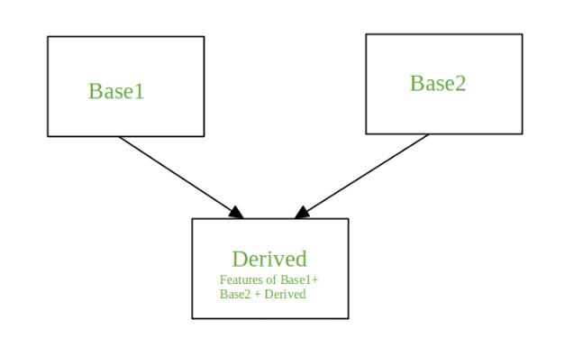
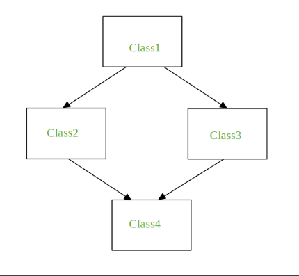

># Viacnásobné dedenie - Multiple Inheritance

Dedičnosť je mechanizmus na dosiahnutie opätovnej použiteľnosti kódu, pretože jedna trieda (podradená trieda) môže odvodiť vlastnosti inej triedy (nadradená trieda). Táto vlastnosť tiež poskytuje priechodnosť, tj. ak trieda C dedí od P, potom všetky podtriedy C dedia tiež od P.

Viacnásobná dedičnosť je taká dedičnosť, keď je trieda odvodená z viac ako jednej základnej triedy. Odvodená trieda pritom zdedí všetky vlastnosti triedy základnej.

~~~
Syntax:

Class Base1:
       Body of the class

Class Base2:
     Body of the class

Class Derived(Base1, Base2):
     Body of the class
~~~
V nasledujúcej časti uvidíme problém, s ktorým sa stretávame počas viacnásobného dedenia, a jeho riešenie si ukážeme na príkladoch.Ide o tzv diamantový problém:

Týka sa nejednoznačnosti, ktorá vzniká, keď dve triedy Class2 a Class3 dedia z nadtriedy Class1 a trieda Class4 dedí z Class2 aj Class3. Ak existuje metóda „m“ , ktorá je prepísanou metódou v jednej z Class2 a Class3 alebo oboch, potom vzniká nejednoznačnosť, ktorú z metód **„m“** by mala Class4 zdediť.

### Prípad keď je metóda prepísaná v oboch triedach
~~~
# Python Program to depict multiple inheritance
# when method is overridden in both classes

class Class1:
	def m(self):
		print("In Class1")
	
class Class2(Class1):
	def m(self):
		print("In Class2")

class Class3(Class1):
	def m(self):
		print("In Class3")
		
class Class4(Class2, Class3):
	pass
	
obj = Class4()
obj.m()

# Vysledok:
# In Class2  t.j. pouzije sa metoda nachadzajuca sa vlavo
~~~
**Poznámka:** Keď zavoláte obj.m() (m na inštancii Class4), výstup je In Class2. Ak je Class4 deklarovaná ako Class4 (Class3, Class2), potom výstup obj.m() bude In Class3.

### Keď je metóda prepísaná v jednej z tried
~~~
#Mu_Inheritance02.py

# Python Program to depict multiple inheritance
# when method is overridden in one of the classes

class Class1:
	def m(self):
		print("In Class1")
	
class Class2(Class1):
	pass

class Class3(Class1):
	def m(self):
		print("In Class3")
	
class Class4(Class2, Class3):
	pass	

obj = Class4()
obj.m()

# Vysledok:
# In Class2  t.j. pouzije sa metoda nachadzajuca sa vpravo
~~~

### Keď každá trieda definuje rovnakú metódu
~~~
# Mu_Inheritance03.py

# Python Program to depict multiple inheritance
# when every class defines the same method

class Class1:
	def m(self):
		print("In Class1")
	
class Class2(Class1):
	def m(self):
		print("In Class2")

class Class3(Class1):
	def m(self):
		print("In Class3")	
	
class Class4(Class2, Class3):
	def m(self):
		print("In Class4")

obj = Class4()
obj.m()

Class2.m(obj)
Class3.m(obj)
Class1.m(obj)

# Vysledok:
# In Class4 

~~~
Výstup metódy obj.m() vo vyššie uvedenom kóde je In Class4 . Vykoná sa metóda „m“ Class4. Na vykonanie metódy „m“ iných tried je možné použiť názvy tried vid. Mu_Inheritance03.py.
Ak chcete zavolať metódu m pre Class1, Class2, Class3 priamo z metódy „m“ Class4, v nižšie uvedenom príklade je vidieť zápis:
~~~
Mu_Inheritance04.py

# Python Program to depict multiple inheritance
# when we try to call the method m for Class1,
# Class2, Class3 from the method m of Class4

class Class1:
	def m(self):
		print("In Class1")
	
class Class2(Class1):
	def m(self):
		print("In Class2")

class Class3(Class1):
	def m(self):
		print("In Class3")	
	
class Class4(Class2, Class3):
	def m(self):
		print("In Class4")
		Class2.m(self)
		Class3.m(self)
		Class1.m(self)

obj = Class4()
obj.m()
~~~
Volanie „m“ Class1 z „m“ Class2 a „m“ Class3 namiesto Class4 je uvedené nižšie:
~~~
# Mu_Inheritance05.py

# Python Program to depict multiple inheritance
# when we try to call m of Class1 from both m of
# Class2 and m of Class3

class Class1:
	def m(self):
		print("In Class1")
	
class Class2(Class1):
	def m(self):
		print("In Class2")
		Class1.m(self)

class Class3(Class1):
	def m(self):
		print("In Class3")
		Class1.m(self)
	
class Class4(Class2, Class3):
	def m(self):
		print("In Class4")
		Class2.m(self)
		Class3.m(self)
	
obj = Class4()
obj.m()
~~~
Výstup vyššie uvedeného kódu má jeden problém spojený s tým, že metóda m z Class1 sa volá dvakrát. Python pre takýto prípad poskytuje riešenie vyššie uvedeného problému pomocou funkcie super(). Pozrime sa, ako to funguje:
~~~
# Mu_Inheritance06.py

# Python program to demonstrate
# super()

class Class1:
	def m(self):
		print("In Class1")

class Class2(Class1):
	def m(self):
		print("In Class2")
		super().m()

class Class3(Class1):
	def m(self):
		print("In Class3")
		super().m()

class Class4(Class2, Class3):
	def m(self):
		print("In Class4")
		super().m()
	
obj = Class4()
obj.m()
~~~
Super() sa vo všeobecnosti používa s funkciou __init__, keď sú inštancie inicializované. Funkcia super prichádza k použitiu, keď sa rozhodujeme ktorú metódu zavolať z method resolution order (MRO) na pomoc.

### Metódy na rozlíšenie poradia (MRO)

V Pythone je každá trieda, či už vstavaná alebo definovaná používateľom, odvodená od triedy objektov a všetky objekty sú inštanciami objektu triedy. Preto je trieda objektov základnou triedou pre všetky ostatné triedy. V prípade viacnásobného dedenia sa daný atribút najskôr vyhľadá v aktuálnej triede, ak sa nenájde, potom sa vyhľadá v nadradených triedach. Nadradené triedy sa prehľadávajú od ľava do pravým takým spôsobom že každá trieda sa prehľadáva raz.
Ak uvidíme vyššie uvedený príklad, poradie vyhľadávania atribútov bude objekty Derived, Base1, Base2. Poradie, ktoré je riadené, je známe ako linearizácia triedy Derived a toto poradie sa zistí pomocou súboru pravidiel nazývaných Method Resolution Order (MRO). Ak chcete zobraziť MRO triedy: 
* Použite metóduy mro(), vráti zoznam napr. Class4.mro()
* Použite atribútu _mro_, vráti n-ticu napr. Class4.__mro__ 
~~~
# Mu_Inheritance07.py

# Python program to demonstrate super()
                     

class Class1:
    def m(self):
        print("In Class1")
                     
class Class2(Class1):
    def m(self):
        print("In Class2")
        super().m()
                     
class Class3(Class1):
    def m(self):
        print("In Class3")
        super().m()
                     
class Class4(Class2, Class3):
   def m(self):
        print("In Class4")
        super().m()
                     
print(Class4.mro())		 #This will print list
                     
print(Class4.__mro__)	 #This will print tuple
~~~
Čoho výstupom je:
~~~
[<class ‘__main__.Class4’>, <class ‘__main__.Class2’>, <class ‘__main__.Class3’>, <class ‘__main__.Class1’>, <class ‘object’>] 
(<class ‘__main__.Class4’>, <class ‘__main__.Class2’>, <class ‘__main__.Class3’>, <class ‘__main__.Class1’>, <class ‘object’>) 
~~~

[Video](https://www.youtube.com/watch?v=zEOeLI5Y-_U&list=PLNAMH_0HgWT_qPUxA1750M5om7iodrCtK&index=6&pp=iAQB)